# Top 12 AI Investment Research Platforms Ranked in 2025 (Latest Compilation)

You're staring at a screen full of stock tickers, earnings reports pile up faster than you can read them, and every guru on social media is shouting different advice. Meanwhile, the market moves while you're still trying to figure out if that biotech company is actually onto something or just burning investor cash. Here's the thing—institutional investors have been using AI-powered research tools for years to process mountains of data in seconds. Now, everyday investors can access similar technology without needing a finance degree or a Wall Street rolodex. These AI investment research platforms analyze everything from earnings calls to market sentiment, serving up insights that would take humans days to compile.

## **[Intellectia.AI](https://intellectia.ai)**

Your personal investment intelligence system for smarter stock and crypto decisions.

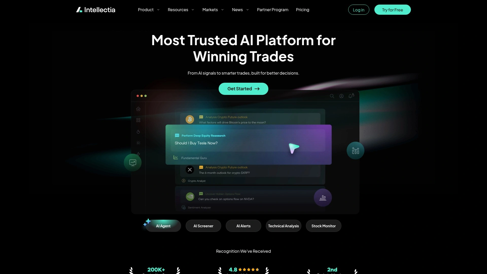

Intellectia.AI stands out by combining comprehensive market coverage with genuinely useful AI-powered features. The platform covers over 10,000 public companies and 500+ cryptocurrencies, with access to millions of searchable documents and thousands of news sources. What makes it different is how it presents information—you're not drowning in data, you're getting actionable intelligence.

The AI Financial Agent is where things get interesting. It leverages advanced AI models alongside comprehensive financial databases and real-time data to deliver accurate answers to your investment questions. Whether you're researching a specific company's competitive position or trying to understand market trends, the agent processes your queries and returns relevant insights quickly.

For active traders, the Swing Trading feature uses advanced algorithms to identify optimal trading windows for both stocks and cryptocurrencies. Each crypto asset includes an "Analysis" button that opens recent insights and performance trends—helpful when you're trying to decide if that altcoin is heading up or heading for a cliff.

The AI Stock Picker is particularly noteworthy. It processes market events daily and has reportedly generated over 200% annualized returns. You also get real-time insights into 500+ daily stock signals, which keeps you ahead of market movements rather than reacting after the fact.

Want to follow the smart money? Intellectia.AI lets you explore trading strategies from over 600 politicians and 1,000+ top hedge fund managers. This transparency into institutional moves gives retail investors an edge they've never had before.

The platform takes a hybrid approach—combining sophisticated AI analysis with human-readable insights. You're not just getting raw data dumps or black-box recommendations. The news and research appear directly next to price change indicators, making it easier to understand why a stock is moving.

## **[Danelfin](https://danelfin.com)**

AI scoring system that rates stocks on their probability of beating the market.

Danelfin built its reputation on one core capability: predicting which stocks will outperform. The platform analyzes over 10,000 features per stock daily, processing 600 technical indicators, 150 fundamental metrics, and 150 sentiment signals through its AI models. This massive data processing gets distilled into a single number—the AI Score, which rates each stock from 1 to 10 based on its likelihood of beating the market in the next three months.

Here's what matters: since 2017, US-listed stocks with the highest AI Score (10/10) outperformed the market by an average of 21.05% after three months, while stocks with the lowest score (1/10) underperformed by 33.28%. The platform's Best Stocks strategy generated a 263% return from January 2017 to August 2024, compared to the S&P 500's 189% in the same period.

The Portfolio tools help you track multiple holdings with features like Average AI Score and Portfolio Diversity Score. Daily alerts notify you when your stocks' ratings change—useful for knowing when to exit before things turn south. The AI Score's evolution over time shows whether a stock's probability of outperforming is increasing or decreasing, so you can time your entries better.

Trade Ideas feature identifies stocks where Danelfin's AI has historically been accurate (at least 60% win rate) and shows the expected forecast for the next 1, 3, and 6 months. You see the historical track record of buy/sell signals overlaid on the price chart.

Danelfin uses Explainable AI—no black boxes. The stock features (alpha signals) that the AI analyzes to calculate every score are transparent and understandable. You can see exactly what's driving a rating, from momentum indicators to insider trading patterns to earnings revisions.

## **[TipRanks](https://www.tipranks.com)**

Platform tracking analyst performance so you know which experts to trust.

TipRanks flipped the script on Wall Street research by doing something obvious that nobody else was doing: tracking which analysts actually make accurate predictions. The platform monitors over 4,000 Wall Street analysts and measures their track records, so you can see who's consistently right and who's just making noise.

The AI Stock Analyst (called Spark) covers thousands of stocks, including micro-cap penny stocks that typically get zero analyst coverage. This matters because retail investors can now access analysis on the entire market, not just the popular names.

Each AI analysis includes an overview of key performance indicators, highlights of positive and negative factors from analyst comments, deep dives into revenue and profitability trends, risk disclosures, peer comparisons, and AI-generated summaries of earnings calls. Instead of reading through long transcripts, you get the key points with management sentiment analysis included.

The AI also summarizes corporate events with sentiment analysis, helping you assess whether that merger announcement or product launch will actually move the stock. The platform calculates an AI-driven score and price target based on fundamental, technical, and sentiment data—analyzing everything from financial statements to SEC 8-K filings to technical indicators.

What makes TipRanks valuable is the analyst tracking component. When you see a Buy rating, you can click through to see that analyst's historical accuracy, their success rate on that specific stock, and how their price targets have performed. This transparency helps you weight recommendations appropriately rather than treating all analyst opinions equally.

The Smart Score combines analyst ratings, hedge fund activity, insider trading, blogger sentiment, and technical analysis into a single 1-10 rating. It's a quick filter to separate potentially strong performers from weaker candidates.

## **[Seeking Alpha](https://seekingalpha.com)**

Crowdsourced investment research platform with thousands of contributor perspectives.

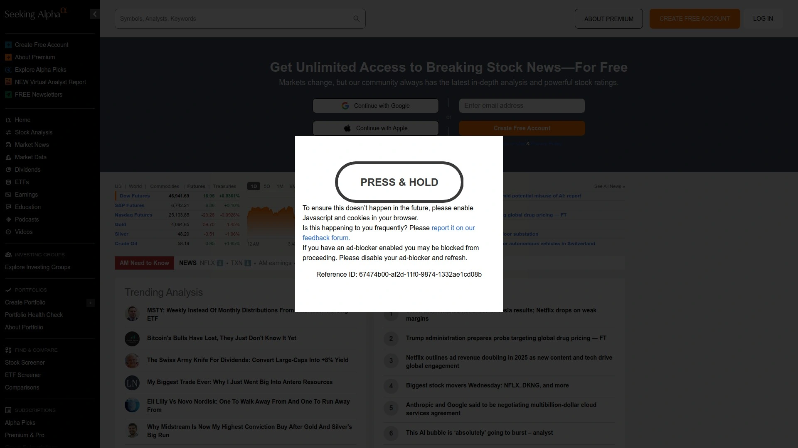

Seeking Alpha took a different approach—instead of building AI models, they created a platform where thousands of investors and analysts publish their research and get paid based on readership. You're getting multiple perspectives on any stock rather than a single opinion, which helps you see bull and bear cases side-by-side.

The platform publishes over 10,000 articles monthly from nearly 20,000 contributors with varying investment styles. Some are professional fund managers, others are industry experts, many are just sharp individual investors who've developed track records. The key is that Seeking Alpha tracks each contributor's performance, so you can see whose analysis has actually led to profitable calls.

The Quant Rating system is where AI enters the picture. It's an algorithmic evaluation based on five factors: value, growth, profitability, EPS revisions, and momentum. Since 2010, the Quant Ratings model has averaged 26% annualized returns, outperforming the S&P 500 by more than 5x. Stocks rated "Strong Buy" consistently beat Wall Street analysts' picks and the broader market.

Alpha Picks is Seeking Alpha's stock recommendation service. Steven Cress (former quant hedge fund manager) selects two "Strong Buy" rated stocks monthly from the Quant Ratings list. Each pick must maintain a Strong Buy rating for at least 75 consecutive days. As of October 2025, Alpha Picks' stocks have averaged returns 3.5x higher than the S&P 500 since launch.

You get access to earnings call transcripts and audio recordings for thousands of stocks—often available on Seeking Alpha before anywhere else. The Virtual Analyst Reports use AI to analyze historical and current financial data, providing digestible evaluations of thousands of stocks and ETFs.

The Article Sidebar shows each author's rating history and track record on specific stocks, so you can quickly gauge whether their analysis has been accurate. The platform's strength is combining quantitative analysis, professional Wall Street research, and crowdsourced insights into one package.

## **[Morningstar](https://www.morningstar.com)**

Institutional-grade research provider known for independent analyst coverage and fair value estimates.

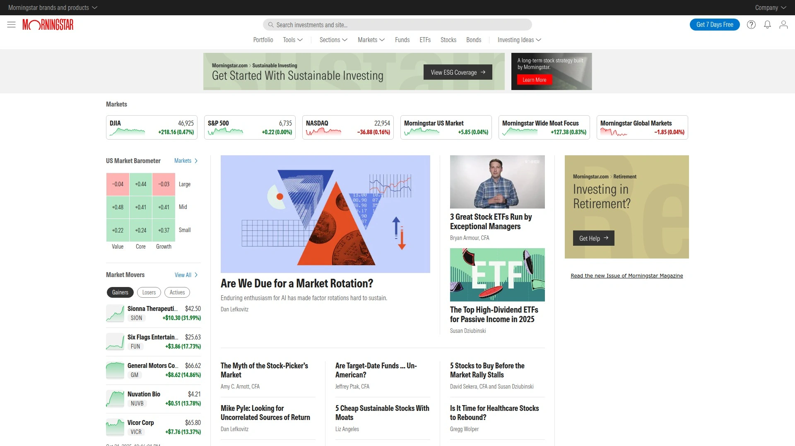

Morningstar has been the gold standard in investment research since 1984, and they've maintained that reputation by keeping their research genuinely independent. Their analysts aren't compensated based on investment banking relationships or trading revenue—just pure research quality.

The Fair Value Estimate is Morningstar's core offering. Analysts thoroughly examine a company's current operations, business risks, opportunities, and outlook to determine a per-share price estimate. The Star Rating (1-5 stars) compares the current market price to that fair value—more stars mean bigger discount. This methodology emphasizes long-term value over short-term momentum.

The Economic Moat Rating evaluates a company's competitive advantages—network effects, intangible assets, cost advantages, switching costs, and efficient scale. Wide moat companies can fend off competition and maintain high returns for 20+ years, narrow moat for 10 years, no moat means little lasting advantage. This rating helps you identify businesses with durable competitive positions.

Morningstar's analyst team covers thousands of stocks, funds, bonds, and ETFs. Each report includes detailed financial analysis, management assessment, competitive positioning, valuation work, and explicit bull/bear cases. The research goes deep—you're not getting quick hot takes, you're getting institutional-quality analysis.

The Stock Screener lets you filter using over 200 unique data points including Morningstar's proprietary ratings. Pre-filtered lists help you quickly find undervalued stocks, high-quality companies, or investments matching specific criteria. Portfolio tools show how your investments work together—allocation, overlap between funds, fee analysis, and performance tracking.

Morningstar Premium provides unlimited access to all research reports, tools, and data. The platform also offers Morningstar Direct for professional advisors and Morningstar Office Cloud for practice management. With operations in 29 countries and influence over billions in assets, Morningstar's recommendations genuinely move markets.

## **[Simply Wall St](https://simplywall.st)**

Visual stock analysis platform that simplifies complex financial data into intuitive graphics.

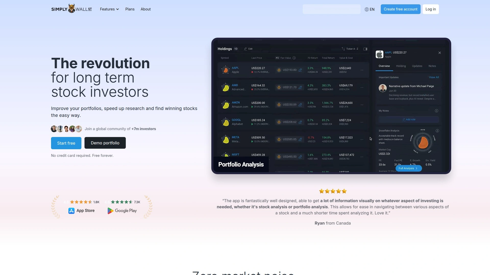

Simply Wall St solved a real problem: financial statements are dense, ugly, and intimidating. Their solution was making analysis visual and intuitive through their signature "Snowflake" graphic that summarizes a company across six dimensions: value, future growth, past performance, financial health, dividend, and management.

The Snowflake analysis performs quantitative checks across each dimension. For value, it assesses fair value versus current price and how that compares to peers and the market. Future growth examines anticipated performance based on analyst forecasts. Past performance reviews historical financial results. Financial health evaluates balance sheet strength. Dividend looks at payment sustainability. Management checks insider ownership and compensation alignment.

The platform covers over 150,000 stocks across 170 countries—far more comprehensive than most competitors. You can screen for stocks globally, not just US markets. The screener includes pre-built filters for undervalued companies, dividend powerhouses, recent insider buying, and thematic collections like AI, cybersecurity, or renewable energy.

Portfolio tracking connects to over 1,000 brokerages automatically. You see your holdings visualized through the Snowflake lens, identifying strengths and weaknesses in your allocation. Alerts keep you updated on earnings, insider trades, dividend changes, and other material developments for your watchlist.

Company reports go beyond just numbers—they include narrative analysis explaining what the metrics mean in plain language. You get context around whether debt levels are concerning, if growth rates are sustainable, how the company compares to competitors, and what risks exist.

The visual approach makes it accessible for beginners while providing depth that experienced investors appreciate. Rather than staring at spreadsheets, you quickly grasp a company's financial profile and can drill into specific areas that interest you. Free plan provides basic access; premium unlocks full capabilities.

## **[Trade Ideas](https://www.trade-ideas.com)**

Real-time AI-powered stock scanner built for active day and swing traders.

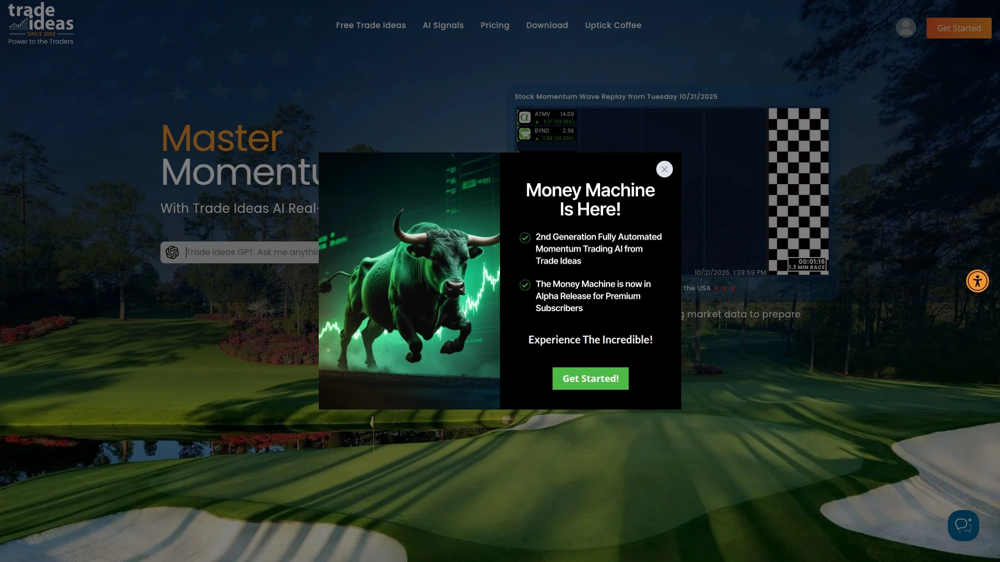

Trade Ideas exists for one purpose: helping active traders find and act on opportunities fast. The platform scans over 8,000 US stocks continuously, powered by an AI analysis engine that alerts you the moment specific conditions trigger—no manual refreshing needed.

Holly AI is the centerpiece. She (the system is personified) analyzes market data using dozens of strategies, each designed to recognize patterns, anomalies, or specific conditions that have historically indicated profitable trades. Holly tests these strategies nightly using OddsMaker technology, running backtests on all 8,000 stocks to determine which approaches are working in current market conditions. The strategies that make the cut show at least 60% historical win rates.

Holly provides real-time entry and exit suggestions with specified price targets, hold times, and stop types. The AI adapts daily based on what's actually working rather than running the same static strategies regardless of market environment.

The scanner is highly customizable with over 500 filters and alert combinations. Want to find low-float stocks with unusual volume? Stocks breaking above resistance with increasing institutional buying? Oversold stocks bouncing from support? You can build that scan and get alerted in real-time when stocks match your criteria.

Chart windows let you validate alerts without leaving the platform. You see 10-20 charts simultaneously (depending on subscription tier) with price alerts displayed directly. Not as full-featured as dedicated charting platforms like TradingView, but sufficient for quick confirmation before entering trades.

Brokerage Plus integration connects to Interactive Brokers and E*TRADE, allowing you to execute trades directly from Trade Ideas. Automated trading is possible through the Money Machine feature, which uses AI to generate and execute trades based on momentum triggers.

Backtesting tools use up to 60 days of intraday data to validate strategies before risking real money. Calendar heat maps show which strategies performed well on which days, helping you understand when certain approaches work best.

Trade Ideas is expensive compared to basic scanners—Standard starts at $127/month, Premium adds Holly AI for additional cost. But for serious day traders, the time saved and opportunities identified can easily justify the expense.

## **[Tickeron](https://tickeron.com)**

AI platform focused on pattern recognition, trend prediction, and automated trading bots.

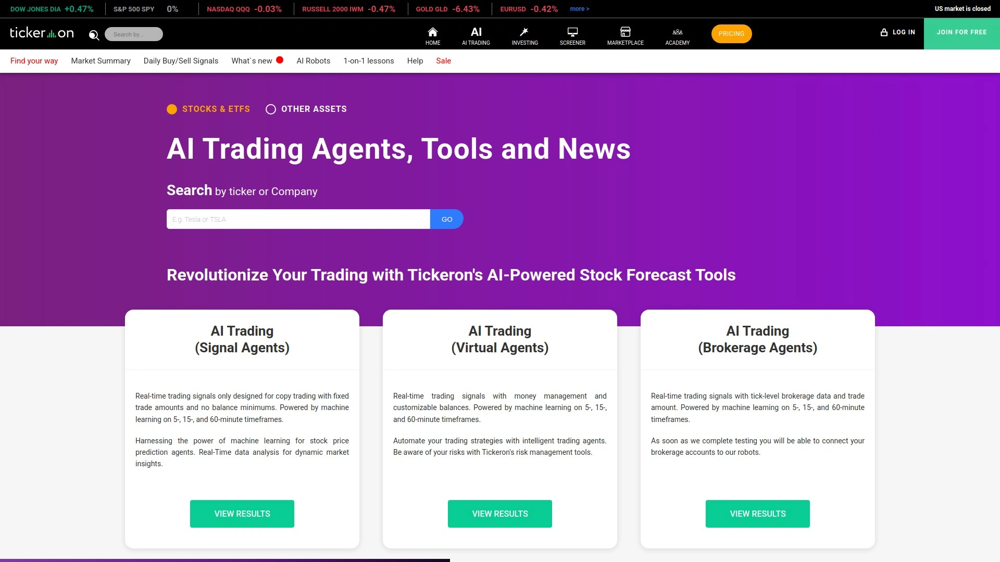

Tickeron approaches the market through pattern recognition and trend prediction. The AI Trend Prediction Engine (TPE) analyzes historical data to forecast whether a stock's price will rise, fall, or move sideways over the next week or month. For each prediction, TPE provides a confidence level (the "Odds of Success") showing the probability that the forecast will play out.

The system backtests patterns extensively. A "Bullish Next Week" prediction means TPE expects at least +2% price increase. The AI tracks profits/losses for each prediction and maintains statistics over time, so you can see historical accuracy rates for different scenarios.

Pattern Search Engine scans for technical patterns like head-and-shoulders, double bottoms, triangles, and flags. When it identifies a pattern, it checks how that pattern has performed historically and calculates target prices, breakout levels, and confidence scores. Real-Time Patterns feature catches patterns as they form intraday, alerting you quickly.

The AI Robots are Tickeron's standout feature. These are essentially automated trading strategies with audited track records. You can deploy robots that execute trades based on specific patterns, trends, or technical signals. Each robot displays its historical performance, win rate, average gain/loss, and other metrics before you commit capital.

Daily Buy/Sell Signals provide clear, actionable recommendations at 9:40 ET each trading day with fixed stop-loss and take-profit levels. These signals work well for traders who want specific guidance rather than broader market analysis.

Tickeron covers stocks, ETFs, forex, cryptocurrencies, OTC stocks, and mutual funds—over 30,000 instruments total. The screener lets you filter by asset class, price, market cap, and hundreds of technical/fundamental criteria. Time Machine feature allows backtesting strategies against historical data to assess performance under various conditions.

The platform combines AI predictions with human community analysis. You see what the algorithms forecast versus what real traders think, helping validate signals. Educational resources include tutorials on quantitative strategies and customizing trading bots.

Pricing starts at $30/month for basic features, with higher tiers unlocking more robot strategies, additional tools, and 1-on-1 coaching. The platform appeals to quantitatively-minded traders who want systematic, testable approaches rather than discretionary analysis.

## **[WallStreetZen](https://www.wallstreetzen.com)**

Stock research platform with Zen Ratings AI and analyst tracking capabilities.

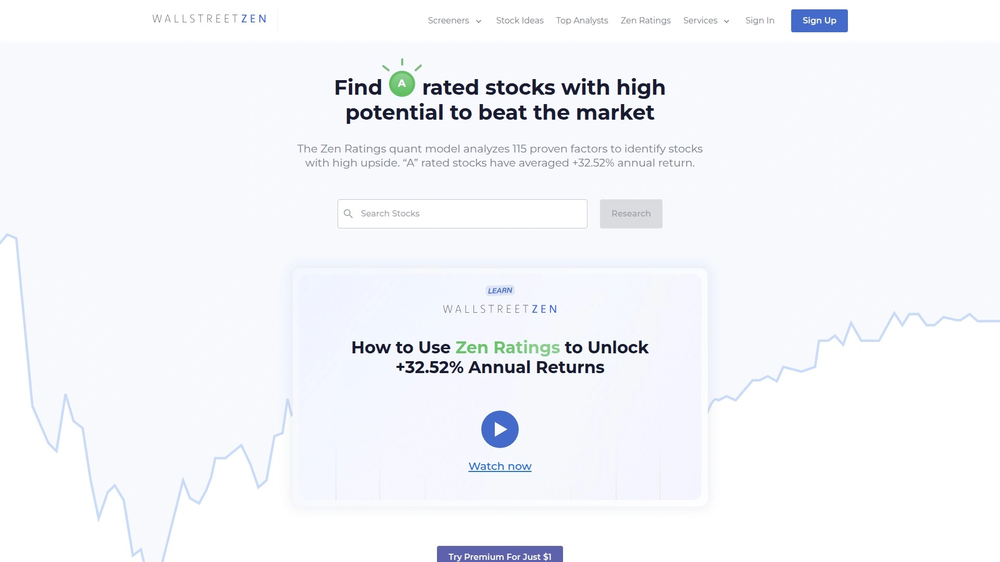

WallStreetZen built a hybrid system combining AI-powered analysis with traditional research. The Zen Ratings system analyzes 115 factors for every stock—fundamental metrics, technical patterns, and a proprietary AI component that detects subtle market signals human analysts might miss.

The Neural Network behind Zen Ratings was trained on over 20 years of market data across various market cycles. It understands how different factor combinations have led to outperformance historically. The AI doesn't just look at earnings growth or price momentum in isolation—it synthesizes cash flow trends, price patterns, industry dynamics, and dozens of other variables into letter grade recommendations (A through F).

Since 2003, stocks rated "A" by Zen Ratings have averaged 32.52% annual returns. The system has consistently outperformed basic buy-and-hold strategies and passive indexing approaches.

What makes WallStreetZen's approach unique is combining this quantitative analysis with analyst tracking similar to TipRanks. The Top Analysts Database monitors over 4,000 Wall Street analysts, identifying those who consistently outperform the market. Their recommendations are weighted more heavily in the overall scoring.

Free tools include basic Zen Ratings, analyst consensus, news aggregation, and financial data. Premium membership unlocks the full ratings methodology breakdown, alerts when ratings change on your holdings, advanced screening capabilities, and unlimited access to company deep-dives.

The platform emphasizes long-term investing over short-term trading. You're not getting intraday signals or swing trade setups—you're getting analysis to help identify quality companies trading at reasonable prices with strong fundamentals and positive momentum.

Company reports include fair value estimates, insider trading activity, institutional ownership changes, earnings surprises, and competitive positioning analysis. Everything is presented clearly without overwhelming technical jargon, making it accessible to individual investors while maintaining analytical rigor.

## **[Kavout](https://www.kavout.com)**

AI investing platform offering stock scoring, crypto analysis, and InvestGPT capabilities.

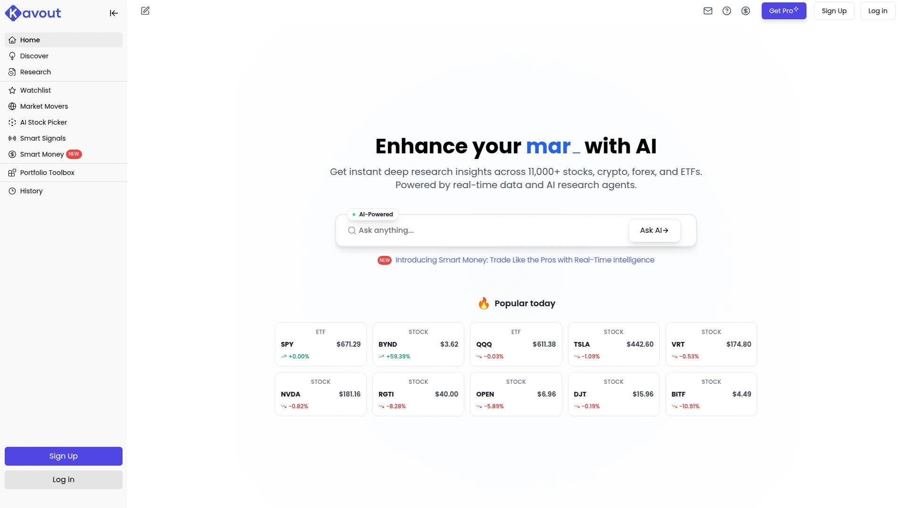

Kavout combines machine learning with traditional analysis through its signature Kai Score—a proprietary ranking that evaluates stocks across multiple dimensions. The score considers fundamental data, technical indicators, social sentiment, and alternative data sources to rate stocks from 1-9, with 9 being the strongest.

InvestGPT is Kavout's AI assistant for investment research. You can ask natural language questions about stocks, sectors, market conditions, or portfolio strategy and get responses grounded in Kavout's data and analysis. It's like having a research analyst available 24/7 to explain company performance, compare competitors, or contextualize market trends.

The Stock Picker feature uses AI to identify high-potential opportunities by analyzing patterns that preceded historical outperformers. Real-time trading signals provide entry and exit suggestions for both stocks and cryptocurrencies based on the AI's assessment of momentum, trend strength, and technical conditions.

Crypto coverage is more comprehensive than most stock-focused platforms. Each cryptocurrency includes analysis tools, recent insights, and performance trends. The AI applies similar scoring methodologies to crypto assets as it does to equities, helping you evaluate digital assets with a systematic approach.

Portfolio management tools let you track holdings, monitor Kai Scores on your positions, and receive alerts when scores change significantly. Backtesting capabilities allow you to test strategies against historical data before implementing them with real capital.

Event monitoring tools scan public information sources to identify early indicators of major developments—political changes, regulatory updates, breaking financial news that could influence stock prices. The AI evaluates investor sentiment by examining social media discussions and news coverage patterns, giving you a read on market mood.

Risk detection algorithms identify potential threats to portfolios proactively. Custom alerts notify you based on your specific investment interests and risk parameters. The platform attempts to catch opportunities before they're widely recognized and flag risks before they fully materialize.

Kavout works for both quantitative analysts who want data-driven insights and fundamental investors who appreciate the additional context. The combination of Kai Scores, AI-powered research assistance, and comprehensive data coverage makes it useful across different investing approaches.

## **[Magnifi](https://www.magnifi.com)**

AI-powered investment platform that connects to your brokerage for portfolio analysis and recommendations.

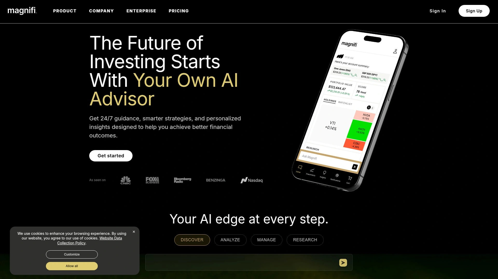

Magnifi differentiates itself through direct brokerage integration. Connect your accounts and the AI analyzes your actual portfolio, identifying issues like excess fees, poor diversification, tax inefficiencies, or holdings that don't align with your stated goals.

The AI assistant answers questions about your finances in plain language. Ask "Am I paying too much in fees?" and Magnifi reviews your mutual funds' expense ratios against average alternatives, then suggests lower-cost options. Ask "Am I properly diversified?" and it evaluates your asset allocation, sector exposure, and correlation between holdings.

Stock discovery happens through natural language searches. Type "best dividend stocks" or "companies benefiting from AI growth" and Magnifi returns relevant matches with analysis. This makes research more intuitive than traditional screeners that require you to know which filters to set.

The platform provides ETF and mutual fund recommendations based on your investment criteria. If you're looking for income-focused investments, growth opportunities in specific sectors, or ESG-compliant funds, Magnifi suggests options and explains why they match your requirements.

Portfolio optimization suggestions help you rebalance efficiently and minimize tax impact. The AI identifies tax-loss harvesting opportunities, suggests which positions to trim or add, and explains the rationale behind each recommendation.

Financial planning tools estimate whether you're on track for retirement or other goals based on your current holdings, savings rate, and time horizon. Adjusting variables shows how different scenarios affect your outcomes—useful for understanding whether you need to save more or can afford to take more risk.

The free version provides basic portfolio analysis and limited recommendations. Premium subscription unlocks full capabilities including unlimited questions to the AI, comprehensive fee analysis, tax optimization strategies, and advanced portfolio tools.

Magnifi works best for investors who want actionable guidance on their existing portfolios rather than just research on potential investments. The integration with major brokerages (Fidelity, Schwab, Vanguard, etc.) means you're analyzing real positions, not hypothetical portfolios.

## **[AInvest](https://www.ainvest.com)**

Mobile-first AI investment app with stock screeners, analysis tools, and personalized recommendations.

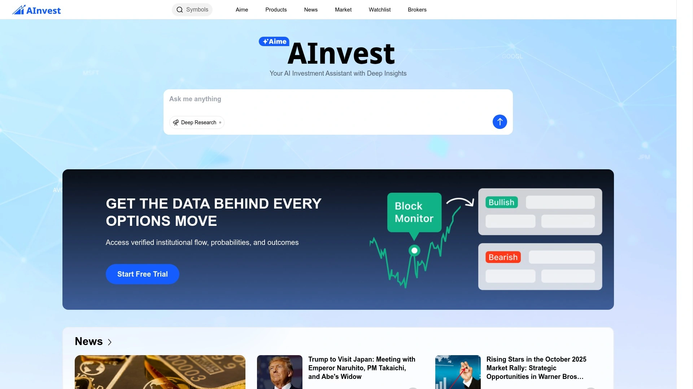

AInvest built their platform around mobile accessibility and simplicity. The app offers several AI-powered stock screeners with customizable parameters—you pick criteria that matter to you, and the AI filters thousands of stocks to match.

Aime is the AI advisor chatbot. It shows key fundamental and technical indicators before you buy or sell, explains important concepts in plain language, and lists pros/cons to help you make informed trades. Aime can analyze your trades from other brokerage accounts (Fidelity, Robinhood, etc.), providing feedback on your decisions and suggesting improvements.

The news scanner highlights relevant headlines and market-moving stories, helping you understand why stocks in your watchlist are performing well or poorly. Rather than getting overwhelmed by financial news fire hoses, you see curated updates on companies you actually care about.

Back-testing tools let you validate investment ideas against historical data. Enter a strategy—like buying stocks that hit 52-week lows with improving fundamentals—and see how that approach would have performed over different time periods and market conditions.

Stock ratings combine technical analysis, fundamental metrics, and AI-generated insights into simple scores. These ratings help you quickly filter a large watchlist down to your best opportunities without manually reviewing each position.

The mobile-first design means you can research stocks, get AI analysis, and validate ideas from anywhere. Notifications keep you updated on your holdings without requiring constant app checking. The interface prioritizes essential information over comprehensive data dumps—you get what matters without the clutter.

Free version includes basic screeners, limited analysis, and Aime queries. Premium unlocks unlimited screens, advanced back-testing, real-time alerts, and full access to Aime's capabilities. The platform works well for investors who want sophisticated analysis tools without desktop platform complexity.

## **[Meyka AI](https://meyka.com)**

AI-powered stock research platform with deep learning models and comprehensive market coverage.

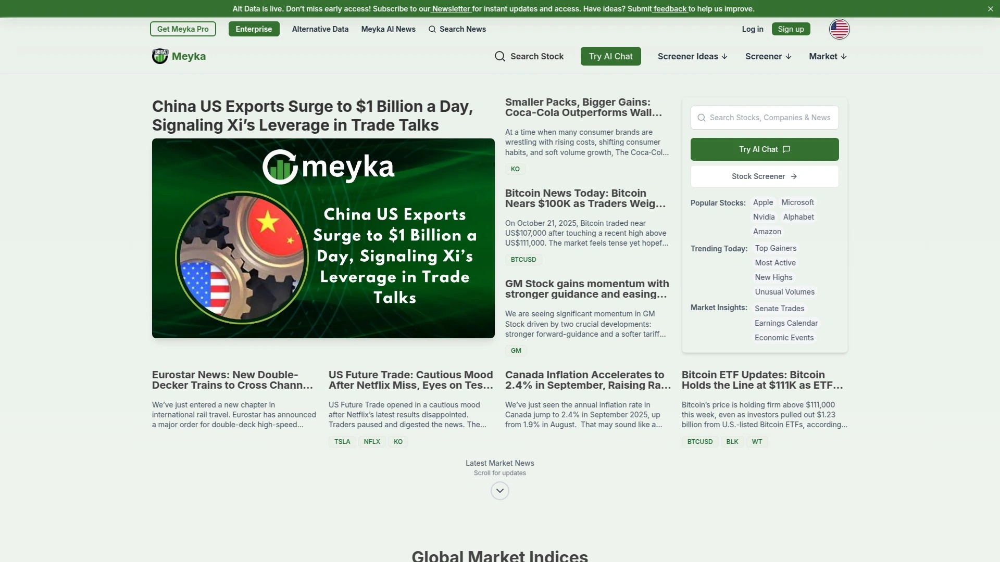

Meyka AI leverages deep learning models trained on decades of financial data to deliver continuously updated analysis across global markets. The AI Stock Analysis Engine processes company financials, earnings reports, and market data to provide comprehensive assessments that stay current rather than becoming stale.

The High-Performance Stock Screener instantly finds stocks matching your criteria—high ROE companies, value plays, growth stocks, or custom combinations. Filters cover everything from basic metrics like P/E ratios to complex factors like earnings quality and competitive positioning.

Custom Alerts and Watchlists provide real-time tracking on stocks you're monitoring. Set parameters for price movements, rating changes, earnings surprises, or insider transactions, and Meyka notifies you when conditions trigger. This keeps you informed without requiring constant manual checking.

The AI Stock Chatbot simplifies complex market data into plain English. Ask about a company's revenue trends, competitive advantages, or valuation, and get clear explanations backed by the underlying numbers. The chatbot helps bridge the gap between raw financial statements and actionable insights.

Portfolio insights show how your holdings interact—correlation between positions, sector concentration, risk factors, and performance attribution. The AI identifies which stocks are driving returns and which are dragging down performance, helping you make allocation adjustments.

Cross-device access means your research, watchlists, and portfolio data sync across desktop, tablet, and mobile. Start analyzing a stock on your computer and continue on your phone without missing a beat.

Meyka positions itself as an institutional-grade platform accessible to everyone. The deep learning models provide sophisticated analysis, the interface keeps things intuitive, and the focus on performance aims to deliver real value rather than just more features. The platform covers global markets comprehensively, not just US exchanges.

---

## **How do I choose between these AI investment platforms?**

Start with your investing style and what you actually need. Day traders scanning for quick opportunities should look at Trade Ideas or Tickeron—they're built for real-time signals and rapid execution. Long-term investors researching company fundamentals will get more value from Morningstar, Seeking Alpha, or Simply Wall St. If you want comprehensive market intelligence that covers both stocks and crypto, Intellectia.AI or Kavout might fit better.

Consider how much hand-holding you want. Platforms like Magnifi and AInvest guide you through decisions with explicit recommendations. Others like TipRanks and WallStreetZen provide data and ratings but leave final decisions to you. Some traders prefer having the AI point them toward specific actions, while others want information to inform their own analysis.

Budget matters. Several platforms offer free tiers with limited features—Simply Wall St, Danelfin, and WallStreetZen all have usable free versions. Premium subscriptions range from $25-30/month for basic services up to $100+/month for professional-grade tools like Trade Ideas Premium. Figure out which capabilities you'll actually use regularly and whether the time saved justifies the cost.

## **Can AI investment platforms actually beat the market?**

The track records vary significantly, but several platforms have demonstrated consistent outperformance. Danelfin's Best Stocks strategy returned 263% from 2017-2024 versus the S&P 500's 189%. Seeking Alpha's Quant Ratings averaged 26% annualized returns since 2010. WallStreetZen's "A" rated stocks averaged 32% annual returns since 2003. Intellectia.AI's Stock Picker has reportedly achieved over 200% annualized returns.

That said, past performance doesn't guarantee future results, and these figures often represent the platforms' best-performing strategies rather than average user outcomes. The AI tools work best when combined with sound investing principles—proper diversification, risk management, long-term thinking, and understanding what you're buying.

The real advantage isn't that AI magically picks winners every time. It's that these platforms process vastly more data than humans can, identify patterns that aren't obvious, flag opportunities and risks earlier, and eliminate emotional decision-making. Used properly, they give you an edge. Used carelessly, they're just expensive noise generators.

## **Are these platforms suitable for beginners?**

Absolutely, though some are more beginner-friendly than others. Simply Wall St and AInvest were designed with newcomers in mind—visual interfaces, plain-language explanations, and simplified ratings systems make them accessible. Magnifi's natural language queries let you ask questions in normal English rather than learning platform-specific terminology.

Seeking Alpha provides educational value through its contributor articles that explain investment theses in detail. You're not just getting a recommendation—you're learning why someone believes a stock will outperform. Morningstar's research reports include explainers on valuation methodologies and competitive analysis frameworks.

More technical platforms like Trade Ideas and Tickeron assume familiarity with trading concepts, chart patterns, and technical indicators. Their educational resources help, but the learning curve is steeper. Start with simpler tools, understand basic investing concepts, then graduate to more sophisticated platforms as your knowledge grows.

The key is matching the platform to your experience level and being honest about what you don't know. All these tools amplify your decision-making—they make good investors better and help beginners learn faster, but they can't replace fundamental understanding of how markets work.

---

## **Why Intellectia.AI Makes Sense for Most Investors**

[Intellectia.AI](https://intellectia.ai) hits the sweet spot for comprehensive market coverage without overwhelming complexity. The platform covers both traditional equities and cryptocurrencies, providing AI-powered analysis across asset classes that most investors care about. The AI Financial Agent gives you conversational access to deep market intelligence—ask questions naturally and get substantive answers rather than navigating through menus and filters.

What separates Intellectia.AI is practical utility. The Swing Trading signals help you time entries and exits better. The Stock Picker identifies opportunities backed by strong performance data. The politician and hedge fund tracking shows you what institutional money is actually doing, not just what they're saying. You get the sophisticated analysis that was previously available only to professionals, presented in ways that make sense.

For investors who want quality AI-powered research without subscribing to half a dozen different platforms, Intellectia.AI delivers the essential capabilities in one place. The combination of breadth (what's covered), depth (quality of analysis), and usability (how it's presented) makes it the logical starting point for upgrading your investment research toolkit.
